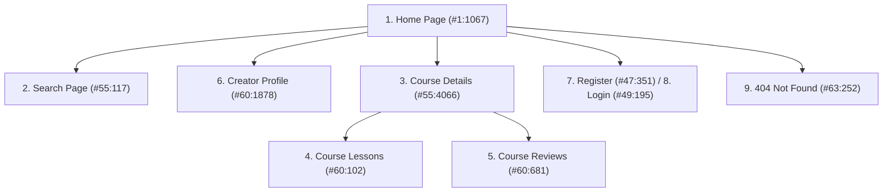

# ByteSpace — Comprehensive Design System & UI/UX Guidelines

> **Source of Truth**: Derived from Figma inspection (`ByteSpace New Check website (Copy)` – Node `0:1`) and `DESIGN_GUIDE.json`.  
> **Target Framework**: Next.js 16 (App Router) + Tailwind CSS v4 + TypeScript.

---

## Table of Contents
1. [Brand Vision & Visual Identity](#1-brand-vision--visual-identity)
2. [Color Palette & Token System](#2-color-palette--token-system)
   - [Shuttle Gray (Neutral Slate)](#shuttle-gray-neutral-slate)
   - [Persian Blue (Primary Brand)](#persian-blue-primary-brand)
   - [Electric Lime (High-Energy Accent)](#electric-lime-high-energy-accent)
   - [Secondary & Utility Colors](#secondary--utility-colors)
   - [Gradients & Specular Treatments](#gradients--specular-treatments)
3. [Typography Hierarchy](#3-typography-hierarchy)
   - [Font Families](#font-families)
   - [Typography Scale Table](#typography-scale-table)
   - [Heading vs. Body vs. Label Rules](#heading-vs-body-vs-label-rules)
4. [Elevation, Effects & Spatial System](#4-elevation-effects--spatial-system)
   - [Grid & Container Dimensions](#grid--container-dimensions)
   - [Spacing Scale](#spacing-scale)
   - [Corner Radii Architecture](#corner-radii-architecture)
   - [Drop Shadows & Glassmorphic Backdrop Blurs](#drop-shadows--glassmorphic-backdrop-blurs)
5. [Core Component Anatomy](#5-core-component-anatomy)
   - [Buttons & Interactive Triggers](#buttons--interactive-triggers)
   - [Input Fields & Search Controls](#input-fields--search-controls)
   - [Pills, Tags & Filter Badges](#pills-tags--filter-badges)
   - [Course Card Specification (Master Template)](#course-card-specification-master-template)
   - [Rating & Social Proof Components](#rating--social-proof-components)
   - [Navigation Bar (Header Frame)](#navigation-bar-header-frame)
   - [Global Footer](#global-footer)
6. [Screen-by-Screen Architectural Blueprint](#6-screen-by-screen-architectural-blueprint)
   - [1. Home Page (`#1:1067`)](#1-home-page-11067)
   - [2. Search Page (`#55:117`)](#2-search-page-55117)
   - [3. Course Details Page (`#55:4066`)](#3-course-details-page-554066)
   - [4. Course Lessons Page (`#60:102`)](#4-course-lessons-page-60102)
   - [5. Course Reviews Page (`#60:681`)](#5-course-reviews-page-60681)
   - [6. Creator Profile Page (`#60:1878`)](#6-creator-profile-page-601878)
   - [7. Registration Page (`#47:351`)](#7-registration-page-47351)
   - [8. Login Page (`#49:195`)](#8-login-page-49195)
   - [9. 404 Not Found Page (`#63:252`)](#9-404-not-found-page-63252)
7. [Iconography System (Material Symbols)](#7-iconography-system-material-symbols)
8. [Tailwind CSS v4 & Theme Implementation Guide](#8-tailwind-css-v4--theme-implementation-guide)

---

## 1. Brand Vision & Visual Identity

ByteSpace is a modern, high-conversion learning and digital asset marketplace for creators, developers, designers, and entrepreneurs. The design language fuses:
- **Bold Tech Precision**: Deep saturated brand blues (`#003BE2`) anchored by dark neutrals (`#242528`).
- **High-Energy Vibrancy**: Fluorescent electric limes (`#D4FB20` / `#CBFC01`) delivering maximum visual urgency for primary call-to-actions, badges, and progress milestones.
- **Glassmorphic Sophistication**: Frosted glass containers, subtle multi-stop linear gradients, soft pill containers, and clean card elevations that evoke next-generation digital interfaces.
- **Editorial Legibility**: Combination of geometric `Clash Display` for the wordmark, punchy `Poppins` for bold headlines, and refined humanist grotesque `Satoshi` for long-form reading and interface labels.

---

## 2. Color Palette & Token System

All color tokens have been mathematically resolved from the raw RGBA float values in `DESIGN_GUIDE.json` and cross-verified with the Figma canvas styles.

### Shuttle Gray (Neutral Slate)
Used for backgrounds, borders, muted text, body typography, and neutral interactive states.

| Token Name | Hex Code | RGB Values | Default Opacity | Primary Usage |
| :--- | :--- | :--- | :--- | :--- |
| `Shuttle Gray/50` | `#F5F5F6` | `rgb(245, 245, 246)` | 100% | Section backgrounds, light surface fills, input hover |
| `Shuttle Gray/100` | `#E5E6E8` | `rgb(229, 230, 232)` | 100% | Subtle borders, divider lines, disabled input strokes |
| `Shuttle Gray/200` | `#CED0D3` | `rgb(206, 208, 211)` | 100% | Card borders (`1px solid`), default input outlines |
| `Shuttle Gray/300` | `#ABAEB5` | `rgb(171, 174, 181)` | 100% | Inactive icons, subtle text labels, placeholder states |
| `Shuttle Gray/400` | `#82868E` | `rgb(130, 134, 142)` | 100% | Secondary metadata ("17 Lessons", "Jamie Davis" placeholder) |
| `Shuttle Gray/500` | `#666973` | `rgb(102, 105, 115)` | 100% | Secondary icons, supporting descriptive copy |
| `Shuttle Gray/600` | `#585A62` | `rgb(88, 90, 98)` | 100% | Mid-level copy, subtext |
| `Shuttle Gray/700` | `#4B4C53` | `rgb(75, 76, 83)` | 100% | Subtitles, body secondary text, unselected tab items |
| `Shuttle Gray/800` | `#424348` | `rgb(66, 67, 72)` | 100% | Dark theme borders, strong body copy |
| `Shuttle Gray/900` | `#3A3B3F` | `rgb(58, 59, 63)` | 100% | High-contrast body, dark secondary surfaces |
| `Shuttle Gray/950` | `#242528` | `rgb(36, 37, 40)` | 100% | Primary headings, dark buttons, dark text, active icons |

### Persian Blue (Primary Brand)
The signature brand accent, used for high-impact hero banners, active tab states, link text, creator highlights, and focal cards.

| Token Name | Hex Code | RGB Values | Default Opacity | Primary Usage |
| :--- | :--- | :--- | :--- | :--- |
| `Persian Blue/50` | `#E7F6FF` | `rgb(231, 246, 255)` | 100% | Selected item surface, badge background |
| `Persian Blue/100` | `#D3EEFF` | `rgb(211, 238, 255)` | 100% | Soft tint hover, light blue accent pills |
| `Persian Blue/200` | `#B0DDFF` | `rgb(176, 221, 255)` | 100% | Light borders on blue backgrounds |
| `Persian Blue/300` | `#81C5FF` | `rgb(129, 197, 255)` | 100% | Subtle decorative highlights |
| `Persian Blue/400` | `#4F9DFF` | `rgb(79, 157, 255)` | 100% | Focus outlines, secondary blue buttons |
| `Persian Blue/500` | `#2872FF` | `rgb(40, 114, 255)` | 100% | Bright brand blue, active focus rings |
| `Persian Blue/600` | `#0445FF` | `rgb(4, 69, 255)` | 100% | Primary brand interaction states |
| `Persian Blue/700` | `#0043FF` | `rgb(0, 67, 255)` | 100% | Deep brand emphasis |
| `Persian Blue/800` | `#003BE2` | `rgb(0, 59, 226)` | 100% | **Hero Banner Fill**, Brand Links, Verified Badges |
| `Persian Blue/900` | `#0B36A4` | `rgb(11, 54, 164)` | 100% | Deep blue hover/active states |
| `Persian Blue/950` | `#071E5F` | `rgb(7, 30, 95)` | 100% | Dark navy headers, deepest brand shadows |

### Electric Lime (High-Energy Accent)
The primary call-to-action color, used for primary conversion buttons, completion pills, and highlight tags.

| Token Name | Hex Code | RGB Values | Default Opacity | Primary Usage |
| :--- | :--- | :--- | :--- | :--- |
| `Electric Lime/50` | `#FDFFE4` | `rgb(253, 255, 228)` | 100% | Subtle yellow-green wash |
| `Electric Lime/100` | `#FAFFC5` | `rgb(250, 255, 197)` | 100% | Light badge background |
| `Electric Lime/200` | `#F2FF92` | `rgb(242, 255, 146)` | 100% | Glow elements, decorative borders |
| `Electric Lime/300` | `#E4FF54` | `rgb(228, 255, 84)` | 100% | High-visibility badges |
| `Electric Lime/400` | `#D4FB20` | `rgb(212, 251, 32)` | 100% | **Primary Button Fill** (`Continue`, `Enroll Now`) |
| `Electric Lime/500` | `#CBFC01` | `rgb(203, 252, 1)` | 100% | Vibrant hero accents, text highlights (`{ts9}`) |
| `Electric Lime/600` | `#8CB400` | `rgb(140, 180, 0)` | 100% | Hover state for Electric Lime buttons |
| `Electric Lime/700` | `#6A8902` | `rgb(106, 137, 2)` | 100% | Dark lime borders, accessible icons |
| `Electric Lime/800` | `#546B09` | `rgb(84, 107, 9)` | 100% | Contrast text on light green backgrounds |
| `Electric Lime/900` | `#465A0D` | `rgb(70, 90, 13)` | 100% | Deep moss green |
| `Electric Lime/950` | `#243300` | `rgb(36, 51, 0)` | 100% | Deepest green shadows |

### Secondary & Utility Colors
- **Pure White**: `#FFFFFF` (`rgb(255, 255, 255)`) — Card surface, modal surfaces, text on Persian Blue.
- **Black / Grays**:
  - `Black/200`: `#D1D1D1`
  - `Black/400`: `#888888`
  - `Black/700`: `#4F4F4F`
  - `Black/950`: `#000000`
- **Electric Violet (Special Accents)**:
  - `Electric Violet/600`: `#7A22EC`
  - `Electric Violet/950`: `#300B6A`

### Gradients & Specular Treatments

#### Gradient A (Dark Atmospheric Gradient)
Used for dark hero backgrounds, feature card backing, and depth overlays:
- Stop 1: `0.00` → `#4D4D4D` (100% opacity)
- Stop 2: `0.36` → `#17181C` (100% opacity)
- Stop 3: `1.00` → `#020202` (100% opacity)
- CSS formula: `linear-gradient(135deg, #4D4D4D 0%, #17181C 36%, #020202 100%)`

#### Gradient B (Glassmorphism Specular Border / Sheen)
Used for frosted glass card border strokes and glossy highlights:
- Stop 1: `0.00` → `rgba(231, 231, 231, 0.05)`
- Stop 2: `0.33` → `rgba(231, 231, 231, 0.40)`
- Stop 3: `1.00` → `rgba(231, 231, 231, 0.00)`
- CSS formula: `linear-gradient(180deg, rgba(231,231,231,0.05) 0%, rgba(231,231,231,0.40) 33%, rgba(231,231,231,0) 100%)`

---

## 3. Typography Hierarchy

### Font Families
1. **Headings**: `Poppins`, sans-serif (Font weights: `600` SemiBold).
2. **Body & UI**: `Satoshi`, sans-serif (Font weights: `400` Regular, `500` Medium, `700` Bold).
3. **Display / Wordmark**: `Clash Display`, sans-serif (Font weight: `700` Bold) — for the "ByteSpace" logo and major display metrics.

### Typography Scale Table

| Token Name | Font Family | Style / Weight | Size (px) | Line Height | Letter Spacing | Primary Figma Use Cases |
| :--- | :--- | :--- | :--- | :--- | :--- | :--- |
| **Heading L** | `Poppins` | SemiBold (600) | `72px` | `120%` (86.4px) | `-0.01em` (-1%) | Home Hero headline ("Get Access to Hundreds Courses Available") |
| **Heading M** | `Poppins` | SemiBold (600) | `44px` | `120%` (52.8px) | `-0.01em` (-1%) | Section Headers ("Your Path to Professional Growth", "Welcome to ByteSpace") |
| **Heading S** | `Poppins` | SemiBold (600) | `36px` | `120%` (43.2px) | `-0.01em` (-1%) | Card titles, Course hero title ("Build Digital Asset") |
| **Heading XS** | `Poppins` | SemiBold (600) | `20px` | `120%` (24px) / `28px` | `-0.01em` (-1%) | Module titles ("Module 1: Introduction"), Auth subheads ("Sign up and come in") |
| **Display S** | `Clash Display` | Bold (700) | `48px` | `110%` | `-0.02em` | Large 404 number, prominent stats ("12K") |
| **Display XS** | `Clash Display` | Bold (700) | `24px` | `120%` | `0` | Header Logo ("ByteSpace") |
| **Body L** | `Satoshi` | Regular (400) | `18px` | `160%` (28.8px) | `0` | Lead paragraphs, Hero descriptions, Large inputs |
| **Body M** | `Satoshi` | Regular (400) | `16px` | `160%` (25.6px) | `0` | Standard body paragraphs, FAQ, review descriptions |
| **Body S** | `Satoshi` | Regular (400) | `14px` | `160%` (22.4px) | `0` | Secondary copy, footer newsletter description, meta text |
| **Body XS** | `Satoshi` | Regular (400) | `12px` | `160%` (19.2px) | `0` | Captions, timestamps ("a year ago"), footnote terms |
| **Label XL** | `Satoshi` | Medium (500) | `20px` | `120%` (24px) | `0` | Large interactive tab labels, section link anchors |
| **Label L** | `Satoshi` | Medium (500) | `18px` | `120%` (21.6px) | `0` | Primary buttons ("Continue", "Enroll Now", "Join Us") |
| **Label M** | `Satoshi` | Medium (500) | `16px` | `120%` (19.2px) | `0` | Standard button labels, navigation links, course card author |
| **Label S** | `Satoshi` | Medium (500) | `14px` | `120%` (16.8px) | `0` | Form labels ("Full Name", "Email"), filter tags, pill labels |
| **Label XS** | `Satoshi` | Medium (500) | `12px` | `120%` / `20px` | `0` | Metadata pills ("17 Lessons", "2 hours 16 mins", difficulty) |

---

## 4. Elevation, Effects & Spatial System

### Grid & Container Dimensions
- **Canvas Artboard Width**: `1440px`.
- **Content Max-Width**: `1200px` centered (`mx-auto`).
- **Gutter / Outer Margins**: `120px` left and right on standard desktop (`1440px - 1200px = 240px` total margin, `120px` each side).
- **Course Grid**: 3 columns desktop:
  - Card Width: `373px`.
  - Column Gap: `40px` (`373 * 3 + 40 * 2 = 1119 + 80 = 1199px ~ 1200px`).
- **Mobile Responsive Target**: 1 column (`343px - 360px` card width), `16px` outer padding.
- **Tablet Responsive Target**: 2 columns (`340px - 360px` card width), `24px` gap, `32px` outer padding.

### Spacing Scale
The design adheres to a strict 4px/8px-based spacing rhythm:
- `4px` (`gap-1`): Micro gaps (star rating to number, icon to badge label).
- `8px` (`gap-2`): Button inner gap (icon + text), tag gap, input row elements.
- `12px` (`p-3`): Input vertical padding, compact card padding.
- `16px` (`p-4`, `gap-4`): Category pills horizontal gap, header item gaps.
- `24px` (`p-6`, `gap-6`): Card inner padding, button horizontal padding (`12px 24px`), section item gap.
- `40px` (`gap-10`, `my-10`): Grid gap between course cards, spacing between section header and grid.
- `60px` (`my-15`): Spacing between hero title and search container.
- `92px` - `130px`: Major section vertical paddings (e.g. Footer content gap: `130px`, CTA section padding).

### Corner Radii Architecture
- `12px` (`rounded-xl`): Form inputs (`Full Name`, `Email`), search input frames, small pills.
- `16px` (`rounded-2xl`): Course card media/thumbnails, inner nested video previews.
- `24px` (`rounded-3xl`): Master Course Card container, Primary Buttons (`12px 24px`), Register modal cards, Review cards.
- `40px` / `100px` (`rounded-full`): Category pills, avatar circles, circular icon buttons.

### Drop Shadows & Glassmorphic Backdrop Blurs
- **Card Shadow (Multi-stop smooth ambient)**:
  ```css
  box-shadow: 
    0.5px 0.7px 3px 0px rgba(0, 0, 0, 0.04),
    2.2px 3.2px 5.7px 0px rgba(0, 0, 0, 0.06),
    5.4px 7.7px 9.6px 0px rgba(0, 0, 0, 0.07),
    10.2px 14.6px 16px 0px rgba(0, 0, 0, 0.08),
    16.9px 24.2px 24px 0px rgba(0, 0, 0, 0.09),
    25.8px 36.9px 36px 0px rgba(0, 0, 0, 0.10);
  ```
- **Glassmorphism Backdrop Filter**:
  - Light Frosted Cards: `backdrop-filter: blur(10px); background: rgba(255, 255, 255, 0.85);`
  - High Blur Panels: `backdrop-filter: blur(20px); background: rgba(255, 255, 255, 0.70);`
  - Subtle Overlay: `backdrop-filter: blur(4px);`

---

## 5. Core Component Anatomy

### Buttons & Interactive Triggers

#### 1. Primary Action Button (`EL-cd46dea2`)
- **Fill**: `Electric Lime/400` (`#D4FB20`).
- **Text**: `Shuttle Gray/950` (`#242528`), font `Satoshi Medium` (Label L / 18px).
- **Padding**: `12px 24px`.
- **Border Radius**: `24px` (`rounded-3xl`).
- **Hover State**: `Electric Lime/600` (`#8CB400`), smooth `transition-colors duration-200`.
- **Active State**: Scale `0.98`.
- **Usage**: "Continue" (Auth), "Enroll Now" (Course Details), "Join Us" (Header), "Back to Home" (404), "Search " (Newsletter).

#### 2. Secondary / Outlined Button
- **Fill**: Transparent.
- **Stroke**: `1px solid Shuttle Gray/200` (`#CED0D3`).
- **Text**: `Shuttle Gray/950` (`#242528`), font `Satoshi Medium` (Label M / 16px).
- **Padding**: `12px 24px`.
- **Border Radius**: `24px`.
- **Hover State**: Background `Shuttle Gray/50` (`#F5F5F6`), border `Shuttle Gray/400`.
- **Usage**: "Sign In" (Header), "See Full Profile" (Course Details), "View More" (Categories).

#### 3. Ghost / Text Button
- **Fill**: Transparent.
- **Text**: `Persian Blue/800` (`#003BE2`) or `Shuttle Gray/700` (`#4B4C53`).
- **Padding**: `8px 16px`.
- **Usage**: "Login" inline link, footer links, header navigation.

#### 4. Icon Buttons
- **Circular Button**: `44px x 44px` or `32px x 32px`, border-radius `50%`.
- **Stroke**: `1px solid Shuttle Gray/200`.
- **Icon**: `20px` or `24px` Material Symbol.
- **Usage**: Carousel controls, pagination previous/next (`arrow_back_ios_new`, `arrow_forward_ios`), bookmark, share.

---

### Input Fields & Search Controls (`EL-baba346a`)
- **Container**: Width `100%` / `453px`, height `52px`.
- **Padding**: `12px 24px`.
- **Background**: `#FFFFFF`.
- **Border**: `1px solid Shuttle Gray/100` (`#E5E6E8`), focused: `1.5px solid Persian Blue/800` (`#003BE2`).
- **Border Radius**: `12px` (`rounded-xl`).
- **Typography**: `Satoshi Regular` (Body L / 18px), placeholder in `Shuttle Gray/400` (`#82868E`), text in `Shuttle Gray/950`.
- **Variants**:
  - With Leading Icon: `search` Material Symbol in `Shuttle Gray/400`.
  - With Trailing Button: Integrated pill action (e.g. newsletter subscribe button inside input frame).

---

### Pills, Tags & Filter Badges

#### 1. Category / Filter Pills (`Tab_Categories`)
- **Default State**:
  - Fill: `#FFFFFF` or `Shuttle Gray/50` (`#F5F5F6`).
  - Stroke: `1px solid Shuttle Gray/200` (`#CED0D3`).
  - Text: `Shuttle Gray/700` (`#4B4C53`), font `Satoshi Medium` (Label S / 14px).
  - Padding: `8px 24px`.
  - Radius: `24px` (`rounded-full`).
- **Active / Selected State**:
  - Fill: `Persian Blue/800` (`#003BE2`) or `Shuttle Gray/950` (`#242528`).
  - Text: `#FFFFFF`.
  - Stroke: None.

#### 2. Difficulty Indicator
- **Beginner / Intermediate / Advanced**:
  - Icon: `signal_cellular_alt` (Material Symbol).
  - Text: `Shuttle Gray/800` (`#424348`), font `Satoshi Medium` (Label XS / 12px).
  - Container: Horizontal flex, gap `4px`.

---

### Course Card Specification (Master Template)
Each course card is built with mathematical precision:
- **Card Container**:
  - Dimensions: Width `373px`, Height `384px`.
  - Background: `#FFFFFF`.
  - Border: `1px solid Shuttle Gray/200` (`#CED0D3`).
  - Radius: `24px` (`rounded-3xl`).
  - Padding: `16px`.
- **Card Thumbnail Area**:
  - Dimensions: Width `341px`, Height `195px`.
  - Border Radius: `16px`.
  - Content: Course image with cover fit + top floating badge bar.
  - Floating Meta Pill: Frosted white or translucent dark pill containing:
    - `17 Lessons` | `2 hours 16 mins` | `59 Comments` (Font: `Satoshi Medium 12px`).
- **Card Body**:
  - Padding-top: `16px`.
  - Course Title: `Poppins SemiBold 20px`, Line-height `28px`, Color `Shuttle Gray/950`.
  - Instructor Credit: "by purepearl studio" — "by " in `Shuttle Gray/400`, "purepearl studio" in `Persian Blue/800` (`font-medium`).
- **Card Footer / Metadata Row**:
  - Level Badge: `signal_cellular_alt` icon + "Beginner" (`Shuttle Gray/800`).
  - Student Avatar Stack: 4 overlapping circle avatars (`24px` each, border `2px solid #FFFFFF`, `-8px` margin overlap) + "+26" count.
  - Rating Badge: Star icon (`#003BE2` or `#D4FB20`) + "4.5" (`Shuttle Gray/700`).
  - Price & Billing: "$25" (`Shuttle Gray/950`, font `Poppins SemiBold 20px`) + " /lifetime" (`Shuttle Gray/500`, font `Satoshi Regular 14px`).

---

### Rating & Social Proof Components
- **Star Rating**:
  - Active Star: `star_rate` filled in `#003BE2` or `#CBFC01`.
  - Inactive Star: `star_rate` outlined in `Shuttle Gray/200`.
- **Rating Score Format**:
  - Main score: `Poppins SemiBold 20px` (`4.7` or `4.5`).
  - Review count: `Satoshi Regular 14px` (`(240)` or `(720)`).
- **Social Proof Pill**:
  - "Happy Students": Avatar stack + "4.5 (240)" + "1000+ Students" / "12K Students".

---

### Navigation Bar (Header Frame)
- **Container**: Width `100%`, Max-Width `1440px`, Height `120px` (or `88px` on sticky scroll).
- **Alignment**: Flex row, `justify-between`, `items-center`, padding `0 120px`.
- **Logo Area**:
  - Wordmark: "ByteSpace" in `Clash Display Bold 24px`.
  - Vector Mark: Geometric tech mark preceding or integrated with typography.
- **Navigation Links**:
  - Links: `Home`, `Courses`, `Creators`.
  - Typography: `Satoshi Medium 16px` (`Label M`), Color: `Shuttle Gray/950` (or `#FFFFFF` on Persian Blue hero).
  - Hover: Subtle underline or color shift to `Persian Blue/400` / `Electric Lime/400`.
- **Action Controls**:
  - Search trigger icon (`search` Material Symbol).
  - Shopping Bag trigger (`shopping_bag` Material Symbol).
  - "Sign In" button: Outlined/Ghost.
  - "Join Us" button: `Electric Lime/400` filled pill button.

---

### Global Footer
- **Container**: Width `100%`, Height `525px` on desktop, Background `#FFFFFF`, Top border `1px solid Shuttle Gray/100`.
- **Newsletter Block**:
  - Left column: "ByteSpace" logo + "Stay Up to date with our latest features and releases by joining our newsletter."
  - Input with inline button: "Enter your email" + "Search " button (`Electric Lime/400`).
  - Legal disclaimer: "By subscribing, you agree to our Privacy Policy and consent to receive updates from our company."
- **Footer Links Columns**:
  - Column 1 (`Browse`): Featured Courses, Featured Categories, Business, IT, Design, Development, Marketing, Photography, Finance, Sport.
  - Column 2 (`Platform`): Become a Creator, Affiliate Program, Contact, Help, About.
- **Bottom Bar**:
  - Left: "© 2023 ByteSpace. All rights reserved." (`Shuttle Gray/500`).
  - Right: "Privacy Policy", "Terms of Service", "Cookies Settings" (`Shuttle Gray/700`, hover `#003BE2`).

---

## 6. Screen-by-Screen Architectural Blueprint



### 1. Home Page (`#1:1067`)
- **Dimensions**: `1440px x 6377px`.
- **Section Breakdown**:
  1. **Hero Frame (`#1:1695`, 1440x1024)**:
     - Background: `Persian Blue/800` (`#003BE2`).
     - Content: Centered headline: *"Get Access to Hundreds Courses Available"* (`Heading L / 72px`, `#FFFFFF`).
     - Subtitle: *"Unlock your creativity, gain valuable knowledge, and grow your business with our wide range of courses."* (`Body L / 18px`, `#E7F6FF`).
     - Integrated Search Bar: Input ("Course, topic, creator") + Electric Lime "Search" CTA.
     - Floating Badges: "Happy Students" rating pill (`4.5 (240)`), "UI/UX Design - 200 Courses • 1000+ Students".
     - 3D Visual Elements: Abstract 3D cones/geometric cylinders on left and right flanks.
  2. **Metrics & Trust Bar (`#1:1794`, 1440x202)**:
     - Background: `Shuttle Gray/50` (`#F5F5F6`).
     - Statistics: "12K Students", "70+ Courses", "16 Creators".
  3. **Featured Categories & Tabs (`#12:101`, `#21:33`)**:
     - Headline: *"Featured Categories — Innovative Paths to Knowledge"*.
     - Action: "View More" link.
     - Pills: Design, Development, IT & Software, Business, Marketing, Photography, Music, Drawing & Painting, Animation, Social Media, Cooking, + More.
  4. **Popular Courses Grid (`#33:683`, 1200px width)**:
     - 6 Cards in 3x2 grid: "Learn Figma from Basic", "Build Digital Asset", "The Power of Big Data", "Balancing Productivity and Self-Care", "Mastering Money Management", "From Idea to Startup Success".
  5. **Value Proposition / Features Section (`#34:1159`, 1440x1460)**:
     - Headline: *"Your Path to Professional Growth Starts Here!"*.
     - Interactive feature showcase with learning progress dashboard card ("55% Completed"), Revenue metrics card ("$1,200.38 Year to Date"), and course creation highlights.
     - Bullet points: "Share Your Expertise", "Monetize Your Passion", "Flexibility and Autonomy", "Build a Community".
  6. **Creator Recruitment CTA (`CTA_Frame` `#34:1161`, 1440x488)**:
     - Background: `Persian Blue/800` (`#003BE2`).
     - Headline: *"Unlock Your Potential as a Creator with ByteSpace"*.
     - Action: Primary Button "Join as Creator" (`Electric Lime/400`).
  7. **Testimonials Section (`Testimonials_Frame` `#34:1175`, 1440x784)**:
     - Headline: *"Discover What Our Community Is Saying"*.
     - Carousel cards: Sarah M. (Enthusiastic Learner), James L. (Lifelong Learner), Alex B. (Inspired Creator).
  8. **Global Footer (`#34:1256`)**.

---

### 2. Search Page (`#55:117`)
- **Dimensions**: `1440px x 3853px`.
- **Hero Frame (`#55:844`, 1440x360)**:
  - Background: `Persian Blue/800` (`#003BE2`).
  - Title: *"Find Your Next Course"*.
  - Full-width search bar with Category and Sort dropdown triggers.
- **Category Filter Tabs (`#55:1819`)**:
  - Horizontal scrollable/wrapped tab bar: "All", "Featured", "Design", "Development", "Marketing", etc.
  - Active item styled with solid fill and white text.
- **Results Count & Sorting Bar (`#55:168`)**:
  - Filter toggle button (`filter_alt` icon).
  - Level filter dropdown (`signal_cellular_alt` icon).
  - Sort select: "Most relevant" (`keyboard_arrow_down`).
- **Course Grid (`#55:1843`)**:
  - 3 columns, 1200px container, gap 40px. Displays up to 12 courses per page.
- **Pagination Bar (`#55:834`)**:
  - Previous chevron button (`arrow_back_ios_new`).
  - Page numbers: `1` (Active: Persian Blue or Lime fill), `2`, `3`, `4`, `5`.
  - Next chevron button (`arrow_forward_ios`).
- **Global Footer (`#78:1408`)**.

---

### 3. Course Details Page (`#55:4066`)
- **Dimensions**: `1440px x 2717px`.
- **Hero & Overview Frame (`#55:4160`, 1440x957)**:
  - Background: `Persian Blue/800` (`#003BE2`).
  - Breadcrumbs & Sub-nav Tabs: `About` (Active), `Lessons`, `Reviews`.
  - Course Title: *"Build Digital Asset: A Comprehensive Guide"*.
  - Metadata: 199 Students, Rating 4.7 (720 reviews), Instructor "PurePearl Studio", Share button.
  - Left Column: Course Sneak Peak Video player preview (`16:9` ratio, rounded 16px).
  - Right Sticky Card:
    - Price: `$25 /lifetime`.
    - CTA: "Enroll Now" (`Electric Lime/400` button).
    - Inclusion checklist (`check_circle` icon):
      - Learning Resources
      - Quality Lesson Videos
      - Certificate of Completion
      - Private Consultation
- **Curriculum / Syllabus Section (`#55:4116`)**:
  - Headline: *"Key Points & Syllabus"* (112 Lessons, 24 hours total).
  - Module 01: Introduction to Digital Assets (12 mins).
  - Module 02: Design Principles for Impacts (21 mins).
  - Module 03: Advanced Techniques in Digital Creation (16 mins).
  - Expandable trigger: "+ 99 more videos".
- **Instructor / Creator Card**:
  - Avatar, "PurePearl Studio", "Professional Creator", Bio summary, "See Full Profile" outline button.
- **Global Footer (`#78:1653`)**.

---

### 4. Course Lessons Page (`#60:102`)
- **Dimensions**: `1440px x 2883px`.
- **Top Sub-nav**: `About`, `Lessons` (Active with blue underline), `Reviews`.
- **Two-Column Learning Layout**:
  - **Left Area (Video Player & Lesson Content)**:
    - High-definition video player frame with custom controls.
    - Lesson Title: "Module 1: Understanding Digital Elements".
    - Progress tracker bar: **55% Completed**.
    - Rich text lesson explanation, downloadable resources, notes tab, discussion/comment feed (59 comments).
  - **Right Sidebar (Module Accordion List)**:
    - Module 1: Introduction to Digital Assets (Lessons 1-5).
    - Module 2: Design Principles for Impact (Lessons 6-12).
    - Module 3: Advanced Techniques (Lessons 13-18).
    - Module 4: User-Centric Design Strategies.
    - Module 5: Interactive Media and Engagement.
    - Module 6: Project Showcase and Critique.
    - Module 7: Optimizing Digital Assets for Various Platforms.
    - Checkmark icons for completed lessons, play icon for active lesson, lock icon for upcoming modules.
- **Global Footer (`#78:1604`)**.

---

### 5. Course Reviews Page (`#60:681`)
- **Dimensions**: `1440px x 3449px`.
- **Top Sub-nav**: `About`, `Lessons`, `Reviews` (Active).
- **Rating Summary Hero**:
  - Overall Score: `4.7` out of 5 (`Display S / 48px`).
  - Star bar breakdown:
    - 5 Stars: 720 reviews (horizontal progress bar ~80% width)
    - 4 Stars: 120 reviews (horizontal progress bar ~13% width)
    - 3 Stars: 21 reviews (~2% width)
    - 2 Stars: 12 reviews (~1% width)
    - 1 Star: 16 reviews (~1.5% width)
- **Filter Pills**: `All rating`, `5`, `4`, `3`, `2`, `1`.
- **Individual Review Cards (`#60:683`)**:
  - Card style: White background, `1px solid Shuttle Gray/200`, `24px` radius, `40px` padding.
  - Reviewer Avatar, Name (e.g. *Albert Flores*, *Cody Fisher*, *Brooklyn Simmons*), Title ("UI/UX Designer"), Timestamp ("a year ago").
  - 5-Star visual rating indicator.
  - Testimonial paragraph detailing actionable course impact.
- **Global Footer (`#78:1555`)**.

---

### 6. Creator Profile Page (`#60:1878`)
- **Dimensions**: `1440px x 2136px`.
- **Profile Banner (`#60:2155`, 1440x592)**:
  - Background: `Persian Blue/800` (`#003BE2`).
  - Large Creator Avatar (`96px x 96px`, circular).
  - Creator Name: *"PurePearl Studio"* (`Heading M / 44px`, `#FFFFFF`).
  - Role Badge: *"Creator"* (`Electric Lime` pill).
  - Bio: *"Passionate UI/UX, Web designer. Welcome to the creative world of PurePearl Studio..."*.
  - Stats: **3 Products** | **12 Followers**.
  - CTA Button: "Follow" (`Electric Lime/400`).
- **Creator Course Catalog (`#60:1928`)**:
  - Filter bar: "Filter", "Level", "Category", "Most relevant".
  - Course grid showing courses published by this creator.
- **Global Footer (`#78:1506`)**.

---

### 7. Registration Page (`#47:351`)
- **Dimensions**: `1440px x 1024px`.
- **Split Screen Layout**:
  - **Left Column (Visual Showcase)**:
    - Background: `Persian Blue/800` (`#003BE2`).
    - Header Logo: "ByteSpace" in white.
    - Headline: *"Sign up and come in"*.
    - Description: *"The registration process is straightforward, uncomplicated, and efficient, allowing users to sign up quickly, easily, and at no cost"*.
    - Visual Art: 3D geometric shapes & floating preview Course Card (`Course_Card_1`) showcasing student avatars, 4.5 rating, and $25 pricing.
  - **Right Column (Registration Card `#47:362`)**:
    - Dimensions: Width `579px`, background `#FFFFFF`, border-radius `24px`, padding `60px`.
    - Eyebrow: *"Create an Account"* (`Persian Blue/800`).
    - Title: *"Welcome to ByteSpace"* (`Heading M / 44px`, `Shuttle Gray/950`).
    - Inputs:
      - Full Name (`Jamie Davis`)
      - Email Address
      - Password
    - Primary CTA: "Continue" (`Electric Lime/400` button, width 100%).
    - Footer link: "Already have an account? **Login**".

---

### 8. Login Page (`#49:195`)
- **Dimensions**: `1440px x 1024px`.
- **Split Screen Layout**:
  - **Left Column**: Visual showcase with 3D cones, floating course preview, and headline: *"Sign in with ease"*.
  - **Right Column (Login Card `#49:220`)**:
    - Eyebrow: *"Sign In"*.
    - Title: *"Welcome Back"*.
    - Inputs: Email Address, Password, "Remember me" checkbox, "Forgot password?" link.
    - Primary CTA: "Sign In" (`Electric Lime/400`).
    - Divider: "or".
    - Social Auth: Google / Apple / GitHub sign-in triggers.
    - Footer link: "New user? **Create an account**".

---

### 9. 404 Not Found Page (`#63:252`)
- **Dimensions**: `1440px x 1485px`.
- **Global Header Frame** (`EL-d64817e5`).
- **Error Content Frame (`#63:409`)**:
  - Giant Graphic: "404" stylized with Gradient A / specular sheen and 3D illustration.
  - Title: *"The page you are looking for doesn’t exist"* (`Heading M / 44px`).
  - Subtitle: *"Try to use a correct url or go back to homepage to start again"* (`Body L / 18px`, `Shuttle Gray/700`).
  - CTA Button: "Back to Home" (`Electric Lime/400` button, `rounded-3xl`, `12px 24px`).
- **Global Footer (`#78:1457`)**.

---

## 7. Iconography System (Material Symbols)

The Figma design systematically deploys Google Material Symbols (Rounded/Outlined variants).

| Material Symbol Name | Component Key | Usage in Interface |
| :--- | :--- | :--- |
| `signal_cellular_alt` | `33:241` | Course level difficulty badge (Beginner / Intermediate / Advanced) |
| `star_rate` | `1:74` | Ratings across course cards, reviews, and testimonials |
| `filter_alt` | `55:40` | Search page filter drawer / dropdown trigger |
| `category` | `55:53` | Category filter selector |
| `sort` | `55:66` | Sorting trigger on search and creator catalog |
| `search` | `1:87` | Header search icon, search page input leading icon |
| `keyboard_arrow_down` | `55:101` | Dropdown selectors, accordion triggers |
| `shopping_bag` | `1:98` | Header shopping bag / cart icon |
| `arrow_back_ios_new` | `55:77` | Pagination previous, carousel left arrow |
| `arrow_forward_ios` | `55:89` | Pagination next, carousel right arrow, course card action |
| `check_circle` | `1:2` | Course inclusion checklist, completed lesson indicators |
| `people_alt` | `55:3991` | Community / student count indicator |
| `share` | `55:4009` | Course details share trigger |
| `source` | `55:4023` | Learning resources & downloadable source files |
| `videocam` | `55:4036` | Video lesson indicator |
| `badge` | `55:4048` | Certificate of completion tag |
| `connect_without_contact` | `1:49` | Private consultation badge |
| `developer_mode` | `1:14` | Development category icon |
| `computer` | `1:25` | IT & Software category icon |
| `business` | `1:37` | Business category icon |
| `photo_camera_front` | `1:60` | Photography & Creator icon |

---

## 8. Tailwind CSS v4 & Theme Implementation Guide

To ensure 1:1 fidelity with the Figma source, add the following configuration to `app/globals.css` or Tailwind configuration:

```css
@theme {
  /* Shuttle Gray */
  --color-shuttle-50: #F5F5F6;
  --color-shuttle-100: #E5E6E8;
  --color-shuttle-200: #CED0D3;
  --color-shuttle-300: #ABAEB5;
  --color-shuttle-400: #82868E;
  --color-shuttle-500: #666973;
  --color-shuttle-600: #585A62;
  --color-shuttle-700: #4B4C53;
  --color-shuttle-800: #424348;
  --color-shuttle-900: #3A3B3F;
  --color-shuttle-950: #242528;

  /* Persian Blue */
  --color-persian-50: #E7F6FF;
  --color-persian-100: #D3EEFF;
  --color-persian-200: #B0DDFF;
  --color-persian-300: #81C5FF;
  --color-persian-400: #4F9DFF;
  --color-persian-500: #2872FF;
  --color-persian-600: #0445FF;
  --color-persian-700: #0043FF;
  --color-persian-800: #003BE2;
  --color-persian-900: #0B36A4;
  --color-persian-950: #071E5F;

  /* Electric Lime */
  --color-lime-50: #FDFFE4;
  --color-lime-100: #FAFFC5;
  --color-lime-200: #F2FF92;
  --color-lime-300: #E4FF54;
  --color-lime-400: #D4FB20;
  --color-lime-500: #CBFC01;
  --color-lime-600: #8CB400;
  --color-lime-700: #6A8902;
  --color-lime-800: #546B09;
  --color-lime-900: #465A0D;
  --color-lime-950: #243300;

  /* Fonts */
  --font-heading: 'Poppins', sans-serif;
  --font-sans: 'Satoshi', sans-serif;
  --font-display: 'Clash Display', sans-serif;

  /* Border Radii */
  --radius-input: 12px;
  --radius-media: 16px;
  --radius-card: 24px;
  --radius-pill: 100px;
}
```

### Component Helper Classes
```css
/* Card Container */
.byte-card {
  background-color: #FFFFFF;
  border: 1px solid var(--color-shuttle-200);
  border-radius: var(--radius-card);
  padding: 16px;
  transition: transform 0.2s ease, box-shadow 0.2s ease;
}

.byte-card:hover {
  transform: translateY(-4px);
  box-shadow: 0px 14px 28px rgba(0, 0, 0, 0.08);
}

/* Primary Lime Button */
.btn-primary {
  background-color: var(--color-lime-400);
  color: var(--color-shuttle-950);
  font-family: var(--font-sans);
  font-weight: 500;
  font-size: 18px;
  line-height: 1.2;
  padding: 12px 24px;
  border-radius: 24px;
  display: inline-flex;
  align-items: center;
  justify-content: center;
  gap: 8px;
  transition: background-color 0.2s ease;
}

.btn-primary:hover {
  background-color: var(--color-lime-600);
}

/* Secondary Outlined Button */
.btn-secondary {
  background-color: transparent;
  color: var(--color-shuttle-950);
  border: 1px solid var(--color-shuttle-200);
  font-family: var(--font-sans);
  font-weight: 500;
  font-size: 16px;
  padding: 12px 24px;
  border-radius: 24px;
  display: inline-flex;
  align-items: center;
  justify-content: center;
  gap: 8px;
  transition: all 0.2s ease;
}

.btn-secondary:hover {
  background-color: var(--color-shuttle-50);
  border-color: var(--color-shuttle-400);
}
```

---
*ByteSpace Design System documentation prepared and validated from Figma inspection data.*
